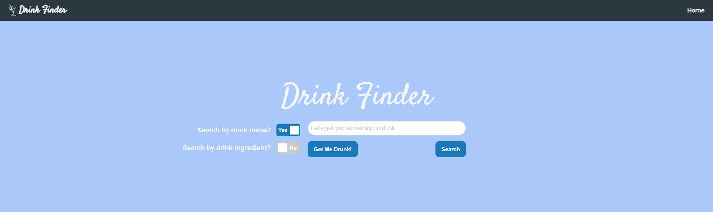
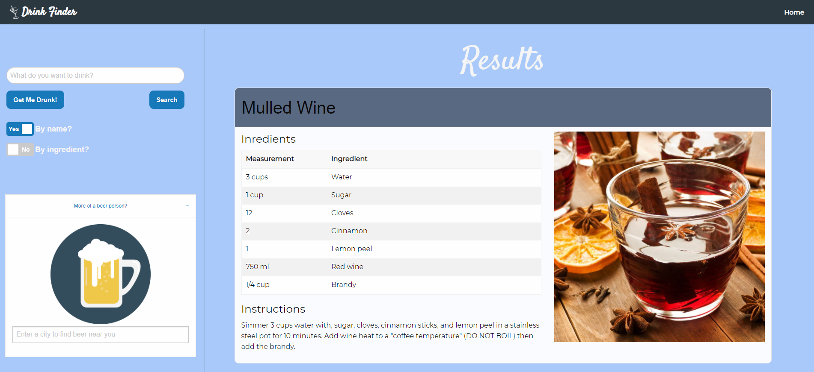

# Drink-Finder

Welcome to Drink Finder!

## Collaborators
<a href="https://github.com/brOmarito">Omar Pacheco</a>, <a href="https://github.com/GarrettLB">Garrett Bryan</a>, and <a href="https://github.com/jaredinyaagha1">Jared Inya-Agha</a>.

## Key Features
* Homepage with options to search by cocktail name or ingredients,
* "Get me drunk button" which displays a random cocktail for you to try,
* Results page displaying styled cards containing different drinks,
* Brewery search section on results page to find local breweries,
* Uses CocktailDb and OpenBrewery apis to returen cocktail recepies and nearby breweries.

## What was the point?
Technically: The main point of this project was to get practice using HTML, JavaScript, CSS, a CSS framework other than Bootstrap, and to collaborate with others.
Practically: The point of the app is to help people find a drink to make based off of either name or ingredient.

## Lessons Learned
One of the main takeaways was getting familiar with Foundation, the CSS framework. It was a little rough at first but after getting into it, it flowed pretty well. Another was getting to set up a project on GitHub, which we used to give status, etc.

## Improvements
We are looking to add features such as:
* Marking and saving favorite drinks. You might find your next favorite drink on a random search and then it's lost forever, so we obviously want to avoid that.
* Searching by multiple ingredients, potentially like a pantry feature. You might have just one of the many ingredients required so let's make it more specific to get to the drinking!

## App Preview
Link: https://bromarito.github.io/drink-finder/

Screenshots:

